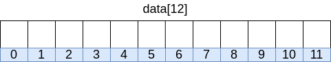
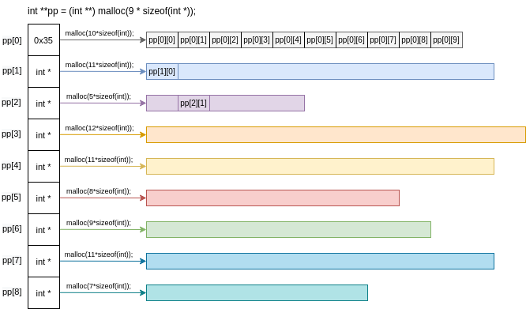
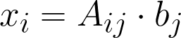

---
**Key:** 
:large_orange_diamond: - **Code Example** 
:large_blue_diamond: - **Code Exercise** 
:red_circle: - **Code Warning**  
[**Previous**: Operators, Loops, Functions](https://github.com/ackirby88/CS107/blob/master/C-Basics/C-4-OpsLoopsFunctions.md)  
[**Next**: Function Pointers](https://github.com/ackirby88/CS107/blob/master/C-Basics/C-6-FunctionPointers.md)

---
# Arrays, Pointers, Memory, References
We touched a little bit on arrays in the data structures section, but, let's look at statically and dynamically allocated arrays in detail.  

## Arrays
Recall, an **array is a variable which stores multiple values of the same type contiguously in memory**.
```C
int data[12];
```
<p align="center">
  
</p>

---
#### Array Declaration
```C
dataType arrayName[arraySize];
```
Note that `arraySize` must be a fixed constant known at **compile time**.  
The compiler *automatically* allocates and deallocates the array memory.  

**<details><summary><b>:large_orange_diamond: Memory Addresses Example</b></summary>**
<p>

:large_orange_diamond: [Array Memory Demo](https://bit.ly/2CFIYEY): We can check to see if the memory is actually contiguous.
```C
#include <stdio.h>

int main(void){
    int ndata = 12;
    int data[ndata];

    for (int i = 0; i < ndata; ++i) {
        printf("data[%2d] address %p\n",i,&data[i]);
    }
    return 0;
}
```

<details><summary><b>Result</b></summary>
<p>

```
data[ 0] address 0x7ffc29e1fbe0
data[ 1] address 0x7ffc29e1fbe4
data[ 2] address 0x7ffc29e1fbe8
data[ 3] address 0x7ffc29e1fbec
data[ 4] address 0x7ffc29e1fbf0
data[ 5] address 0x7ffc29e1fbf4
data[ 6] address 0x7ffc29e1fbf8
data[ 7] address 0x7ffc29e1fbfc
data[ 8] address 0x7ffc29e1fc00
data[ 9] address 0x7ffc29e1fc04
data[10] address 0x7ffc29e1fc08
data[11] address 0x7ffc29e1fc0c
```  
</p>
</details>

</p>
</details>

---
#### Array Initialization
We can initialize arrays during the declaration:
```C
int arr1[4] = {4, 234, 22, -1};
int arr2[]  = {45, 107, 207, 4, 0};
```

---
#### Array Access
We can simply access arrays by using `[]`. For example, 
```C
int b = data[2];
```
:red_circle: **Be careful when accessing data elements!** :red_circle:  
- The compiler won't stop you from accessing elements out-of-bounds (can set a compiler flag to check though)
- Can accidently access elements beyond allocated memory
```C
int data[4] = {0, 0, 0, 0};

printf("data[4] = %d\n",data[4]); // index 4 is out of bounds
>>> data[4] = -585229896
```

---
#### Multidimensional Arrays
We can also create multidimensional arrays, e.g. 
```C
int dim2d[20][8];
int dim3d[10][3][44];
```

---
### Array Memory Location and Limitations
- Static arrays have limitations on how many elements can be allocated
- Arrays are allocated on the **memory stack**: computer's memory which stores temporary variables created by a function 
- The **actual size limit of the stack** depends on how much space your CPU thread has allocated, e.g. **2 megabytes** 

---
## Pointers
- We can obtain the **memory address** of a variable and store it in a **pointer** variable.  
- If we have a variable `var`, then we can **access its address in memory by `&var`**.  
- We can assign a **pointer** to the address in memory: `int *pvar = &var`.  
- To print the address in the C language, we use the format `%p`.

**<details><summary><b>:large_orange_diamond: Print Address</b></summary>**
<p>
  
```C
int var;
printf("var's address: %p\n",&var);
>>> var's address: 0x7ffc29e1fbe0
```
</p>
</details>

**<details><summary><b>:large_orange_diamond: Pointer `*` Placement </b></summary>**
<p>

- The declaration of pointers is flexible in terms of the `*` placement relative to **spaces**. 
```C
int *p1;
int* p2;
int * p3;
```
</p>
</details>

**<details><summary><b>:large_orange_diamond: Suggested Pointer `*` Placement </b></summary>**
<p>
  
By placing `*` next to the variable name, it helps provide an implicit local assignment.
```C
int *p1, v1;  // p1 is an integer pointer, v1 is an integer
int* p2, v2;  // p2 is an integer pointer, v2 is an integer (NOT a pointer)
int *p3, *p4; // p3 is an integer pointer, p4 in an integer pointer
```
</p>
</details>

</p>
</details>

---
### Getting the Address and Value
- If we wish to **assign the address to a variable** or **pass the variable by address**, we **use the `&` operator.**  
- To **get the value from a pointer**, we can either **dereference the value by using `*pvar`** or **`var[0]`**.

**<details><summary><b>:large_orange_diamond: Assigning and Accessing Pointers </b></summary>**
<p>
  
```C
/* assign pointer */
int v1;
int *p1 = &v1;  // assign address of v1 to p1
int v2 = *p1;   // assign v2 to the value pointed by p1
int v3 = p1[0]; // assign v3 to the value pointed at the 0-index pointed by p1
```
</p>
</details>

**<details><summary><b>:large_orange_diamond: Pass By Address</b></summary>**
<p>
  
```C
void my_function(int *ad){
  int v0 = *ad; // access the value stored at ad
  ad[0] = 46;   // set the value
  *ad = 46;     // or equivalently
}

void main(void){
  int var = 6;  
  my_function(&var);  // pass by address
}
```
</p>
</details>


#### Working Example
```C
#include <stdio.h>
int main(){
   int *pc, c;
   
   c = 22;
   printf("Address of c: %p\n", &c);
   printf("Value of c: %d\n\n", c);  // 22
   
   pc = &c;
   printf("Address of pointer pc: %p\n", pc);
   printf("Content of pointer pc: %d\n\n", *pc); // 22
   
   c = 11;
   printf("Address of pointer pc: %p\n", pc);
   printf("Content of pointer pc: %d\n\n", *pc); // 11
   
   *pc = 2;
   printf("Address of c: %p\n", &c);
   printf("Value of c: %d\n\n", c); // 2
   return 0;
}
```

#### Pointer Arithmetic
Pointers simply point to memory address. Nothing is stopping us from actually using arithmetic on the pointer itself to access other elements stored beyond the base pointer.
```C
int array[2] = {212, 1054};
int ind2 = *(array + 1); // := array[1] = 1054
```
:large_orange_diamond: [Pointer Arithmetic Demo](https://bit.ly/3g6UJTg)

---
## Memory
As we saw above, the array sizes must be known at compile time and the maximum number of elements is limited system-assigned stack size (and the amount of stack already occupied). To get around these limitations, we introduce **Dynamic Memory Allocation**.

### C Dynamic Allocation and Deallocation
Dynamic memory allocation in C is achieved by `malloc` and `calloc`.

#### `malloc`
The `malloc()` function stands for memory allocation. It is a function which is used to allocate a block of memory dynamically.  
It reserves memory space of specified size and returns the null pointer pointing to the memory location.  
The pointer returned is usually of type void which means that we can assign malloc function to any pointer.
**Syntax:**
```C
 void *malloc(byte_size);
```
Example:
```C
int main(void){
  int *my_ints = (int *) malloc(16 * size(int)); // allocate a block of memory the size of 16 integers (64 bytes)
  if(my_ints != NULL) free(my_ints);             // deallocate the block of memory
  my_ints = NULL;
  
  return 0;
}
```
The values found within the the allocated memory is *garbage* until you fill in the values.

#### `calloc`
Similarly, the function `calloc` declared in `<stdlib.h>` allocates memory dynamically but also initializes the bits to `0`.  
**Syntax:**
```C
void *calloc(size_t nelements, size_t element_size);
```
**Example:**
```C
int main(void){
  int *my_ints = (int *) calloc(16, size(int));  // allocate a block of memory the size of 16 integers (64 bytes) and initialize to 0
  if(my_ints != NULL) free(my_ints);             // deallocate the block of memory
  my_ints = NULL;
  
  return 0;
}
```

#### Double, Triple, and Beyond Pointers
Recall that we call have double (pointers containing pointers), triple pointers, or more. Note that when do allocate pointers containing pointers, the data is only contiguous within their individual memory blocks and the momory block containing the pointer addresses.
**Example:**
```C
// allocate pointer of pointers memory
int **pp = (int **) malloc(9*sizeof(int *));

// allocate each block
pp[0] = (int *) malloc(10*sizeof(int));
pp[1] = (int *) malloc(11*sizeof(int));
pp[2] = (int *) malloc( 5*sizeof(int));
pp[3] = (int *) malloc(12*sizeof(int));
pp[4] = (int *) malloc(11*sizeof(int));
pp[5] = (int *) malloc( 8*sizeof(int));
pp[6] = (int *) malloc( 9*sizeof(int));
pp[7] = (int *) malloc(11*sizeof(int));
pp[8] = (int *) malloc( 7*sizeof(int));
...
// free each block
for (int i = 0; i < 9) {
  free(pp[i]); pp[i] = NULL;
}

//free pointer of pointers
free(pp); pp = NULL;
```


#### Recommended Array Arithmetic
In the previous example, we saw that using data structures containing pointers of pointers made the memory space discontiguous.  
This may result in very poor performance if we are trying to perform matrix-based calculations.  

Suppose we wish to perform a matrix-vector product:  

<p align="center">
  
</p>

where `i` and `j` represent the indexes into the matrix and vector.  
We need to allocate and access the memory in a contiguous manner. To do so, we will **allocate a single block of contiguous memory** and perform the calculation as follows:
```C
// Naive Matrix-Vector Multiplication
const int M = 32;
const int N = 64;

double *A = (double *) malloc(M*N*sizeof(double));
double *b = (double *) malloc(  N*sizeof(double));
double *x = (double *) malloc(M  *sizeof(double));

... // fill in A and b
... // zero out x

// version 0
for (int j = 0; j < N; ++j) {
  for (int i = 0; i < M; ++i) {
      x[i] += A[j*M + i] * b[j];
  }
}

... // zero out x 
// version 1
for (int j = 0; j < N; ++j) {
  const double *Aj = A[j*M];
  const double bj = b[j];
  for (int i = 0; i < M; ++i) {
      x[i] += Aj[i] * bj;
  }
}

// free memory
free(A); A = NULL;
free(b); b = NULL;
free(x); x = NULL;
```

## Pass by Value, Pointer, Reference (C++)
Now that we have command of pointers, we can examine how to pass variables to functions by three approaches.

#### Pass by Value: Variable *Copied*
In *pass by value*, the value that is passed as a function argument is **copied** into a temporary variable on the stack by the compiler.  
Therefore, we cannot actually modify the value of the variable passed into the function are an argument. Second, if we are passing a `struct` or an object, this can be very slow.
```C
#include <stdio.h>

void try_resetting(int a){
  a = 0;
}

int main(void){
  int b = 10;
  try_resetting(b); // pass by value -- copy of b passed to function
  
  printf("Value of b = %d\n",b); // value of b = 10
  return 0;
}
````

#### Pass by Pointer
If we wish to modify the value inside the function or send an object, e.g. struct or class, we can *pass by pointer* which means we will pass the address of the variable as the fucntion argument.
```C
#include <stdio.h>

void try_resetting(int *a){
  *a = 0;
}

int main(void){
  int b = 10;
  try_resetting(&b); // pass by pointer -- send address of b to function
  
  printf("Value of b = %d\n",b); // value of b = 0
  return 0;
}
````

#### Pass by Reference (C++ only)
C++ introduced *pass by reference* which looks like passing by value but it the value is modified, the original object will reflect those changes.
```C++
#include <stdio.h>

void try_resetting(int &a){
  a = 0;
}

int main(void){
  int b = 10;
  try_resetting(b); // pass by pointer -- send address of b to function
  
  printf("Value of b = %d\n",b); // value of b = 0
  return 0;
}
```

If we want pass by reference but make sure we do not modify the value or object, we use the `const` modifier.
```C++
void try_resetting(const int &a);
```

---
Let's look at all three approaches when a struct is the object passed to a function.  
:large_orange_diamond: [Passing Structs By Value, Pointer, and Reference](https://bit.ly/3fMX05R)

---
[**Next**: Function Pointers](https://github.com/ackirby88/CS107/blob/master/C-Basics/C-6-FunctionPointers.md)
